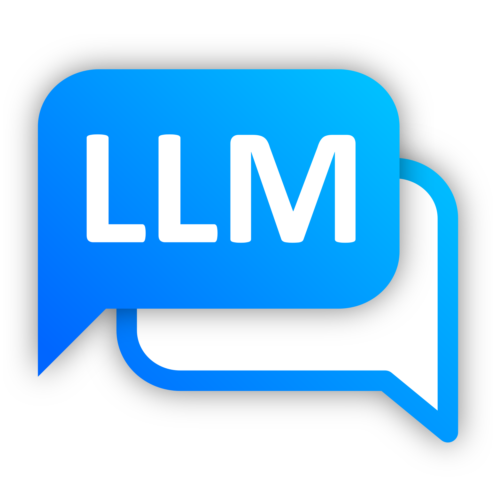

<p align=center>
  
</p>

# <p align=center>LLM Extension for Command Palette</p>

<p align=center>This is an extension for <a href="https://learn.microsoft.com/en-us/windows/powertoys/command-palette/overview">PowerToys Command Palette</a> that allows you to chat with a large language model (LLM) directly.</p>

<p align=center>
  
  
</p>

## Demo Video

https://github.com/user-attachments/assets/d8b707a9-b086-470f-8d01-7508091ebd9d

It currently supports the following APIs:

- [Ollama](https://ollama.com/)
- [OpenAI](https://platform.openai.com/docs/overview) (and any other compatible API, such as [Docker Model Runner](https://docs.docker.com/model-runner/))
- [Azure OpenAI](https://learn.microsoft.com/en-us/azure/cognitive-services/openai/overview)
- [Google](https://aistudio.google.com/)
- [Mistral](https://console.mistral.ai/)

## Installation

### PowerToys Command Palette

You can find the extension by searching "Find Command Palette extensions from ..." in Command Palette and install the extension directly.


### WinGet

You can download it via WinGet.

```
winget install LioQing.LLMExtensionforCommandPalette
```

### Microsoft Store

You can download it from the Microsoft Store.

<a href="https://apps.microsoft.com/detail/9NPK6KSDLC81">
  
</a>

### GitHub Releases

You can download it from the [GitHub Releases](https://github.com/LioQing/llm-extension-for-cmd-pal/releases) page.

## Setup

There is a [YouTube playlist with setup tutorials for different services](https://www.youtube.com/playlist?list=PLtpfYcxJV4LHu0gpKagHWjYR1Lghulnt8).
